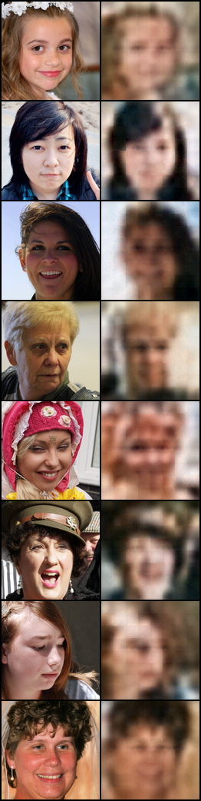
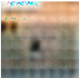
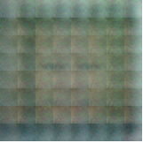
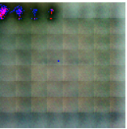
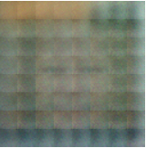
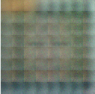

# Text to Image - Parti

The paper selected is [Parti](https://arxiv.org/pdf/2206.10789v1.pdf). The code used was based on this [repo](https://github.com/lucidrains/parti-pytorch).

## Installation

Use the package manager [pip](https://pip.pypa.io/en/stable/) to install foobar.

```bash
pip install parti-pytorch
pip install datasets
pip install transformers
pip install sentencepiece
```

## Usage
Run:

Run the notebook parti.ipynb on Jupyter/Google Colab.

## Data

The training consisted of two main steps as stated on the paper:
- "The first stage
involves training a tokenizer that turns an image into a sequence of discrete visual tokens for training
and reconstructs an image at inference time"
- "The second stage trains an autoregressive sequence-to-
sequence model that generates image tokens from text tokens"

For the first stage, the dataset used for training was [FFHQ (thumbnails128x128)](https://github.com/NVlabs/ffhq-dataset), which helped the model learn how to encode and reconstruct an image. During the second step of the training process, the model was trained using [FFHQ with image captions](cr7Por/ffhq_controlnet_5_2_23). In this second stage, the model learns to convert text tokens into latent space of image tokens.

However, for both parts, not all the dataset was used since it was causing memory issues / too much training time. For the first stage, ~11,000 images were used and for the second, ~39,600 images with caption.

## Sample after training
After the first stage of training, the model results were the following:

<p align="center">

</p>

<p align="center">
  In the left column, the input image, in the right column, the reconstructed image:
</p>

After the second stage of training, the model output was:

<p align="center">

</p>

<p align="center">
  Prompt: 'an old man smiling wearing a hat'
</p>

<p align="center">

</p>

<p align="center">
  Prompt: 'young girl blowing out candles on her birthday cake'
</p>

<p align="center">

</p>

<p align="center">
  Prompt: 'a kid with long and red hair'
</p>

<p align="center">

</p>

<p align="center">
  Prompt: 'blue'
</p>

<p align="center">

</p>

<p align="center">
  Prompt: 'red'
</p>

## Parameters
During each stage of the training, I got two different numbers of parameters, I think the difference could be the "Super-Resolution Upsampler" mentioned in the papar.
- Model parameters during 1st stage: 163.48M
- Model parameters during 2nd stage: 169.58M
- Text encoding model parameters: T5 - large 770M

